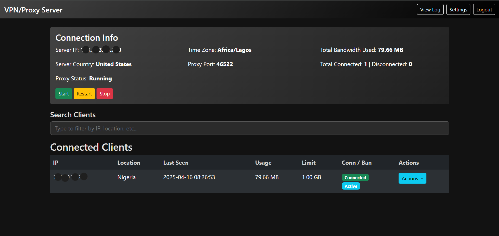

<!--
   README for "VPN/Proxy Server" by thehackitect
   Replace placeholders, adjust image references, and add your own content as needed.
-->

<p align="center">
  
</p>

<h1 align="center">Dark-Mode VPN/Proxy Server</h1>

<div align="center">

<a href="https://github.com/thehackitect"></a>
<a href="LICENSE"></a>


</div>

---

## Overview

**“Dark-Mode VPN/Proxy Server”** is a powerful yet intuitive tool that transforms a standard VPS into a robust, feature‑rich proxy server. Built in **Python/Flask**, it provides a sleek web dashboard with real-time usage analytics, user management, ban/unban controls, data limits, and much more—while keeping it all wrapped in a modern, dark-themed UI.

<p align="center">
  
</p>

### Key Features

- **Real-Time Usage Charts** – Instantly see bandwidth usage per IP or globally, in MB/GB.
- **User Management** – Ban/unban IPs, set data limits, forcibly disconnect, search, and filter.
- **Logging & Export** – Automatic connection logs, CSV export, and easy log clearing.
- **Dark-Mode UI** – A visually appealing interface that’s easy on the eyes.
- **Configurable** – Adjust server ports, time zone, data usage policies, and more via a built-in settings page.

---

## Table of Contents

- [Overview](#overview)  
- [Features](#key-features)  
- [Getting Started](#getting-started)  
- [Usage](#usage)  
- [Screenshots](#screenshots)  
- [Contributing](#contributing)  
- [License](#license)

---

## Getting Started

1. **Clone or Download** this repository:
   ```bash
   git clone https://github.com/thehackitect/ProxyVPN.git
   cd ProxyVPN

Create a Virtual Environment (recommended):

bash


python -m venv venv
source venv/bin/activate  # or venv\Scripts\activate on Windows
Install Dependencies:

bash


pip install -r requirements.txt
Typical requirements might include:

Flask

requests

sqlalchemy

pytz (for timezone handling)

pyinstaller (optional if bundling into an executable)

Run the Server:

bash


python vpnserver.py
Then visit http://127.0.0.1:8080 in your browser.

Usage
Login with default credentials (admin / password) or set your own in server_config.ini.

Start/Stop the proxy from the “Server Control” section.

Manage Clients from the “Connected Clients” table.

Ban/Unban

Set data limit

Disconnect

For a more detailed feature overview, see Overview.

Contributing
Contributions are welcome! Here’s how you can help:

Fork the project.

Create a new branch (git checkout -b feature/some-feature).

Commit your changes (git commit -m 'Add some feature').

Push to the branch (git push origin feature/some-feature).

Open a Pull Request.

Feedback, bug reports, and feature requests are also greatly appreciated—please file an issue if you encounter any problems.

License
This project is licensed under the MIT License.
© 2023 thehackitect – All rights reserved.


Explanation & Adjustments
.gitignore covers common Python artifacts, virtual env folders, logs, etc.

The README includes:

A banner or logo (docs/images/banner.png) at the top (you can add your own).

Badges: A shield for the maintainer, the license, star count, etc. Adjust the URLs and naming if needed.

A screenshot (docs/images/screenshot.png) in the “Overview” or a “Screenshots” section.

Installation instructions, usage, plus a Table of Contents for easy navigation.

A short mention of the MIT license and instructions on how to contribute.

You can rename your repository or paths if needed (e.g. ProxyVPN vs. something else).

If your images live somewhere else or you have different filenames, just edit the img src="..." references accordingly.